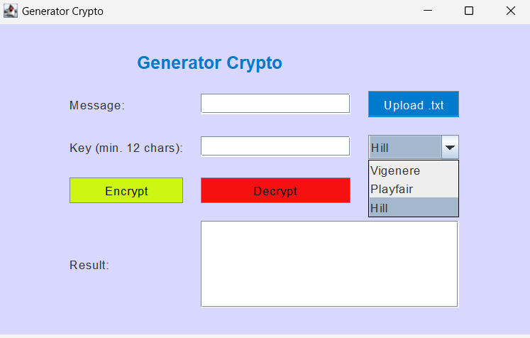

Here is a sample `README.md` file for the repository you shared, written in English:

---

# Cryptography Cipher Application

This is a Java-based GUI application that implements three classic cryptographic ciphers: **Vigenere Cipher**, **Playfair Cipher**, and **Hill Cipher**. The application allows you to both encrypt and decrypt messages using any of these ciphers.

## Table of Contents
- [Features](#features)
- [Requirements](#requirements)
- [Installation](#installation)
- [Usage](#usage)
- [Cipher Descriptions](#cipher-descriptions)
- [Contributing](#contributing)
- [License](#license)

## Features
- **Vigenere Cipher**: Encrypt and decrypt messages using the Vigenere cipher.
- **Playfair Cipher**: Encrypt and decrypt messages using the Playfair cipher.
- **Hill Cipher**: Encrypt and decrypt messages using the Hill cipher.
- GUI built with **Java Swing** for an easy-to-use interface.

## Requirements
To run this project, you need:
- **Java 8** or higher
- A Java IDE like **IntelliJ IDEA**, **Eclipse**, or a text editor with a Java build tool like **Maven** or **Gradle**

## Installation
Follow these steps to get the project up and running on your local machine:

1. **Clone the repository**:
    ```bash
    git clone https://github.com/nafishafi/crytografi-chiper.git
    ```

2. **Navigate to the project directory**:
    ```bash
    cd crytografi-chiper
    ```

3. **Open the project**:
    - If you're using an IDE, open the project folder.
    - If you're using the command line, compile the Java files:
      ```bash
      javac -d bin src/*.java
      ```

4. **Run the project**:
    You can run the `Main` class to start the application.
    ```bash
    java -cp bin Main
    ```

## Usage
1. After launching the application, you will see options for **Vigenere**, **Playfair**, and **Hill** ciphers.
2. Enter the message you want to encrypt or decrypt in the text box labeled "Message."
3. Enter the key for the selected cipher in the "Key" field.
4. Choose the cipher type from the drop-down menu.
5. Click **Encrypt** to encrypt the message or **Decrypt** to decrypt the message.
6. The result will be displayed in the output text area.

### Screenshots


## Cipher Descriptions

### Vigenere Cipher
The Vigenere cipher is a method of encrypting alphabetic text by using a simple form of polyalphabetic substitution. A key is repeated across the plaintext, and each letter is shifted according to the corresponding letter in the key.

### Playfair Cipher
The Playfair cipher encrypts pairs of letters (digraphs), using a 5x5 grid of letters constructed from the keyword. It is a digraph substitution cipher that encodes each pair of letters based on their relative position in the grid.

### Hill Cipher
The Hill cipher is a polygraphic substitution cipher that uses linear algebra. A block of letters is converted into a vector and multiplied by a matrix (the key) to create an encrypted vector, which is then converted back into letters.

## Contributing
If you'd like to contribute, please fork the repository and submit a pull request with your proposed changes. Issues and feature requests are also welcome!

1. Fork the repo.
2. Create your feature branch (`git checkout -b feature/new-feature`).
3. Commit your changes (`git commit -m 'Add new feature'`).
4. Push to the branch (`git push origin feature/new-feature`).
5. Open a Pull Request.

---